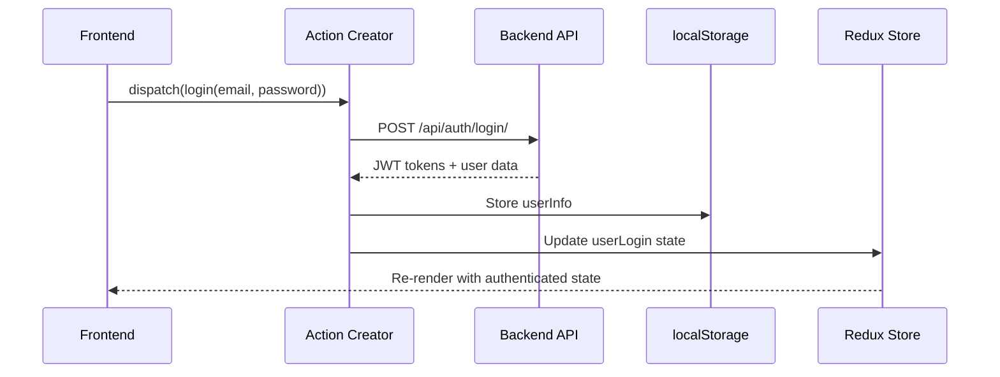
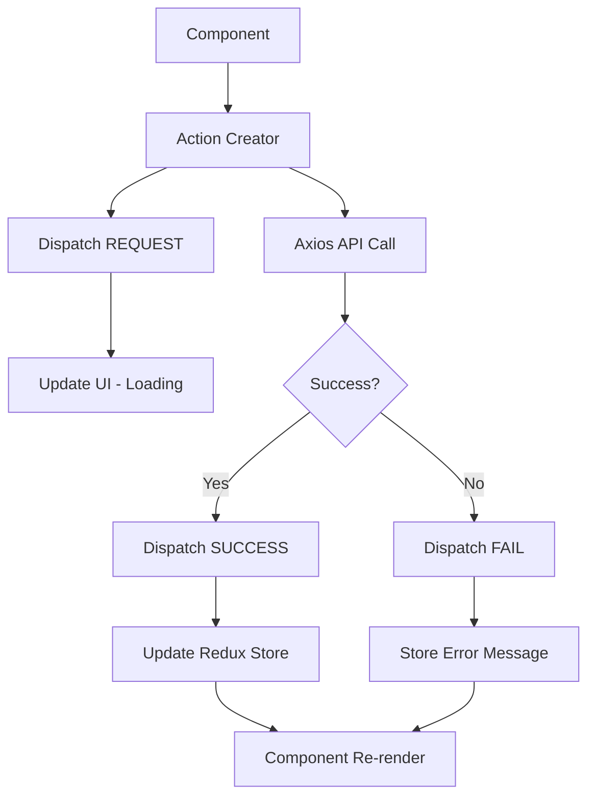

# API Integration Documentation

## Overview

The Ribbit frontend integrates with a Django REST Framework backend using Axios for HTTP requests. API calls are managed through Redux action creators with JWT token-based authentication.

## Base Configuration

### Backend URL Configuration

```javascript
// securityUtils/vars.js
export let backendUrl = 'http://localhost:8000/';
```

**Environment Configuration**:
- Development: `http://localhost:8000/`
- Production: Should be configured via environment variables

### Axios Configuration

Global Axios configuration is managed through utility functions:

```javascript
// securityUtils/setToken.js
const setToken = (token) => {
    if (token) {
        axios.defaults.headers.common["Authorization"] = "Bearer " + token;
    } else {
        delete axios.defaults.headers.common["Authorization"];
    }
};
```

## Authentication Integration

### JWT Token Management

**Token Storage**: JWT tokens are stored in:
1. Redux store for application state
2. localStorage for persistence across sessions

**Token Usage Pattern**:
```javascript
// In action creators
const {
    userLogin: { userInfo },
} = getState();

const config = userInfo ? {
    headers: {
        'Content-type': 'application/json',
        Authorization: `Bearer ${userInfo.access}`
    }
} : null;
```

### Authentication Flow



## API Endpoint Patterns

### Base URL Structure

All API endpoints follow the pattern: `{backendUrl}api/{domain}/{action}/`

### Authentication Endpoints

```javascript
// Login
POST /api/auth/login/
Body: { username, password }
Response: { access, refresh, user_data }

// Register
POST /api/auth/register/
Body: { username, email, password, c_password }
Response: { user_data, tokens }

// Password Reset Request
POST /api/auth/send-reset-password-email/
Body: { email }
Response: { message }

// Password Reset Confirm
POST /api/auth/reset-password/{token}/
Body: { password, c_password }
Response: { message }
```

### Post Management Endpoints

```javascript
// List Posts
GET /api/post/all/{sub}/
Query Params: ?sort={sort_type}&search={search_term}
Headers: Authorization (optional for guest users)
Response: { data: [posts] }

// Post Details
GET /api/post/{id}/
Headers: Authorization (optional)
Response: { post_data }

// Create Post
POST /api/post/create/
Headers: Authorization (required)
Body: { title, content, subribbit, nsfw }
Response: { post_data }

// Update Post
PUT /api/post/update/{id}/
Headers: Authorization (required)
Body: { title, content, nsfw }
Response: { updated_post }

// Delete Post
DELETE /api/post/delete/{id}/
Headers: Authorization (required)
Response: { message }
```

### Comment Management Endpoints

```javascript
// Get Post Comments
GET /api/comment/all/{post_id}/
Headers: Authorization (optional)
Response: { data: [comments] }

// Create Comment
POST /api/comment/create/
Headers: Authorization (required)
Body: { post_id, content }
Response: { comment_data }

// Like/Unlike Comment
POST /api/comment/like-unlike/
Headers: Authorization (required)
Body: { comment_id }
Response: { like_status }

// Delete Comment
DELETE /api/comment/delete/{id}/
Headers: Authorization (required)
Response: { message }
```

### Subribbit (Community) Endpoints

```javascript
// List Communities
GET /api/subribbit/all/
Headers: Authorization (optional)
Response: { data: [subrabbits] }

// Community Details
GET /api/subribbit/{name}/
Headers: Authorization (optional)
Response: { subribbit_data }

// Create Community
POST /api/subribbit/create/
Headers: Authorization (required)
Body: { name, description, type }
Response: { subribbit_data }

// Join Community
POST /api/subribbit/join/{id}/
Headers: Authorization (required)
Response: { membership_status }

// Get Community Members
GET /api/subribbit/members/{id}/
Headers: Authorization (required)
Response: { data: [members] }
```

### Vote Management Endpoints

```javascript
// Vote on Post
POST /api/vote/
Headers: Authorization (required)
Body: { post_id, vote_type }
Response: { vote_data }
```

### User Management Endpoints

```javascript
// User Profile
GET /api/user/{username}/
Headers: Authorization (optional)
Response: { user_data }

// Update Profile
PUT /api/user/update-profile/
Headers: Authorization (required)
Body: { profile_data }
Response: { updated_profile }

// User Posts
GET /api/user/{username}/posts/
Headers: Authorization (optional)
Response: { data: [user_posts] }
```

### Notification Endpoints

```javascript
// Get Notifications
GET /api/notification/all/
Headers: Authorization (required)
Response: { data: [notifications] }
```

## Request/Response Patterns

### Standard Request Configuration

```javascript
const config = {
    headers: {
        'Content-type': 'application/json',
        Authorization: `Bearer ${userInfo.access}`
    }
};
```

### Request Body Patterns

**POST Requests**:
```javascript
const { data } = await axios.post(
    backendUrl + 'api/endpoint/',
    requestBody,
    config
);
```

**GET Requests with Query Parameters**:
```javascript
let url = backendUrl + `api/post/all/${sub}/`;
if (sort && sort !== 'latest') {
    url += `?sort=${sort}`;
}
if (search) {
    url += `?search=${search}`;
}

const { data } = await axios.get(url, config);
```

### Response Data Structure

**Successful Response**:
```javascript
{
    data: [...], // Array for list endpoints
    // OR
    // Single object for detail endpoints
    message: "Success message" // Optional
}
```

**Error Response**:
```javascript
{
    detail: "Error message",
    message: "Alternative error field"
}
```

## Error Handling Patterns

### Standard Error Handling

```javascript
export const apiAction = (params) => async (dispatch, getState) => {
    try {
        dispatch({ type: ACTION_REQUEST });
        
        const { data } = await axios.post(url, params, config);
        
        dispatch({
            type: ACTION_SUCCESS,
            payload: data
        });
        
    } catch (error) {
        dispatch({
            type: ACTION_FAIL,
            payload: error.response?.data?.detail || 
                    error.response?.data?.message || 
                    'Operation failed'
        });
    }
};
```

### Error Response Handling

Common error handling scenarios:

1. **Network Errors**: Connection failed, timeout
2. **Authentication Errors**: 401 Unauthorized, expired tokens
3. **Authorization Errors**: 403 Forbidden
4. **Validation Errors**: 400 Bad Request with field-specific errors
5. **Server Errors**: 500 Internal Server Error

### Error Display Patterns

```javascript
// In components
const { error, loading } = useSelector(state => state.domain);

if (loading) return <Loader />;
if (error) return <Message variant="danger">{error}</Message>;
```

## Authentication-Aware API Calls

### Conditional Authentication

Some endpoints work for both authenticated and guest users:

```javascript
export const listPosts = (sub, sort, search) => async (dispatch, getState) => {
    const { userLogin: { userInfo } } = getState();
    
    // Configure request based on authentication status
    const config = userInfo ? {
        headers: {
            'Content-type': 'application/json',
            Authorization: `Bearer ${userInfo.access}`
        }
    } : null;
    
    const { data } = await axios.get(url, config);
};
```

### Protected Endpoints

Some endpoints require authentication:

```javascript
// Always require authentication
export const createPost = (postData) => async (dispatch, getState) => {
    const { userLogin: { userInfo } } = getState();
    
    if (!userInfo) {
        dispatch({
            type: CREATE_POST_FAIL,
            payload: 'User not authenticated'
        });
        return;
    }
    
    const config = {
        headers: {
            'Content-type': 'application/json',
            Authorization: `Bearer ${userInfo.access}`
        }
    };
    
    // Proceed with API call
};
```

## Data Flow Patterns

### Typical API Integration Flow



### List Data Pattern

```javascript
// Action: Fetch list data
export const fetchList = () => async (dispatch) => {
    dispatch({ type: LIST_REQUEST });
    
    try {
        const { data } = await axios.get(endpoint);
        dispatch({
            type: LIST_SUCCESS,
            payload: data.data // Note: backend returns { data: [...] }
        });
    } catch (error) {
        dispatch({
            type: LIST_FAIL,
            payload: error.response?.data?.detail || 'Failed to fetch'
        });
    }
};

// Component: Display list
const ListComponent = () => {
    const { items, loading, error } = useSelector(state => state.list);
    
    useEffect(() => {
        dispatch(fetchList());
    }, []);
    
    if (loading) return <Loader />;
    if (error) return <Message variant="danger">{error}</Message>;
    
    return (
        <div>
            {items.map(item => <ItemComponent key={item.id} item={item} />)}
        </div>
    );
};
```

### Create/Update Pattern

```javascript
// Action: Create new item
export const createItem = (itemData) => async (dispatch, getState) => {
    dispatch({ type: CREATE_REQUEST });
    
    try {
        const { userLogin: { userInfo } } = getState();
        const config = {
            headers: {
                'Content-type': 'application/json',
                Authorization: `Bearer ${userInfo.access}`
            }
        };
        
        const { data } = await axios.post(endpoint, itemData, config);
        
        dispatch({
            type: CREATE_SUCCESS,
            payload: data
        });
        
        // Optional: Refresh list data
        dispatch(fetchList());
        
    } catch (error) {
        dispatch({
            type: CREATE_FAIL,
            payload: error.response?.data?.detail || 'Creation failed'
        });
    }
};
```

## Pagination and Filtering

### Query Parameter Handling

```javascript
// Build URL with query parameters
const buildURL = (baseURL, params) => {
    const url = new URL(baseURL);
    Object.keys(params).forEach(key => {
        if (params[key]) {
            url.searchParams.append(key, params[key]);
        }
    });
    return url.toString();
};

// Usage
const url = buildURL(backendUrl + 'api/posts/', {
    sort: 'hot',
    search: 'react',
    page: 1
});
```

### Search Functionality

```javascript
export const searchPosts = (searchTerm) => async (dispatch) => {
    if (!searchTerm.trim()) {
        dispatch(listPosts()); // Reset to all posts
        return;
    }
    
    dispatch({ type: POST_LIST_REQUEST });
    
    try {
        const url = `${backendUrl}api/post/all/home/?search=${encodeURIComponent(searchTerm)}`;
        const { data } = await axios.get(url);
        
        dispatch({
            type: POST_LIST_SUCCESS,
            payload: data.data
        });
    } catch (error) {
        dispatch({
            type: POST_LIST_FAIL,
            payload: 'Search failed'
        });
    }
};
```

## File Upload Integration

### Image Upload Pattern

```javascript
export const uploadImage = (imageFile) => async (dispatch, getState) => {
    dispatch({ type: UPLOAD_REQUEST });
    
    try {
        const { userLogin: { userInfo } } = getState();
        const formData = new FormData();
        formData.append('image', imageFile);
        
        const config = {
            headers: {
                'Content-Type': 'multipart/form-data',
                Authorization: `Bearer ${userInfo.access}`
            }
        };
        
        const { data } = await axios.post(
            backendUrl + 'api/upload/',
            formData,
            config
        );
        
        dispatch({
            type: UPLOAD_SUCCESS,
            payload: data.image_url
        });
        
    } catch (error) {
        dispatch({
            type: UPLOAD_FAIL,
            payload: 'Upload failed'
        });
    }
};
```

## Performance Considerations

### Request Optimization

1. **Debouncing**: For search queries
2. **Caching**: Store API responses in Redux to avoid repeated calls
3. **Pagination**: Load data in chunks for large datasets
4. **Optimistic Updates**: Update UI immediately, rollback on error

### Error Recovery

```javascript
// Retry mechanism for failed requests
export const retryableAction = (data, retryCount = 0) => async (dispatch) => {
    try {
        await apiCall(data);
    } catch (error) {
        if (retryCount < 3) {
            setTimeout(() => {
                dispatch(retryableAction(data, retryCount + 1));
            }, 1000 * Math.pow(2, retryCount)); // Exponential backoff
        } else {
            dispatch({ type: ACTION_FAIL, payload: 'Request failed after retries' });
        }
    }
};
```

## Security Considerations

### Token Security

1. **Storage**: Tokens in localStorage (consider httpOnly cookies for production)
2. **Expiration**: Handle token refresh automatically
3. **Transmission**: Always use HTTPS in production

### Input Validation

```javascript
// Client-side validation before API calls
export const createPost = (postData) => async (dispatch) => {
    // Validate input
    if (!postData.title.trim()) {
        dispatch({
            type: CREATE_POST_FAIL,
            payload: 'Title is required'
        });
        return;
    }
    
    // Sanitize input
    const sanitizedData = {
        ...postData,
        title: postData.title.trim(),
        content: postData.content.trim()
    };
    
    // Proceed with API call
};
```

## Testing API Integration

### Mock API Responses

```javascript
// For testing
jest.mock('axios');
const mockedAxios = axios as jest.Mocked<typeof axios>;

test('should fetch posts successfully', async () => {
    const mockPosts = [{ id: 1, title: 'Test Post' }];
    mockedAxios.get.mockResolvedValue({ data: { data: mockPosts } });
    
    const dispatch = jest.fn();
    const getState = jest.fn();
    
    await listPosts()(dispatch, getState);
    
    expect(dispatch).toHaveBeenCalledWith({ type: POST_LIST_SUCCESS, payload: mockPosts });
});
```

---

*This documentation covers the API integration patterns used throughout the Ribbit frontend. For specific endpoint details, refer to the backend API documentation.*