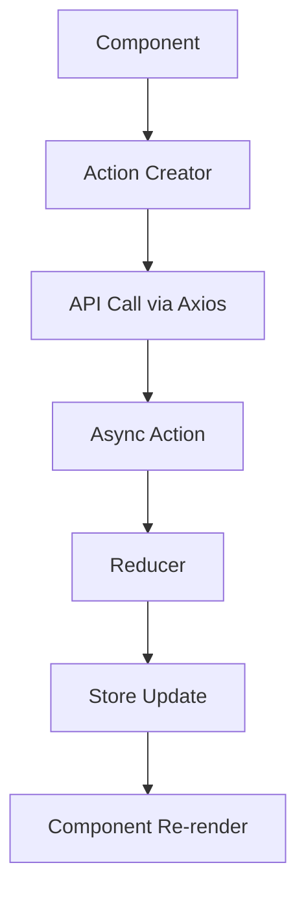

# Ribbit Frontend Architecture Documentation

## Overview

The Ribbit frontend is a React 17 application using Redux for state management. It implements a Reddit-like interface with posts, comments, subreddits ("suribbits"), user authentication, and social features.

## Technology Stack

- **React 17.0.2** - Component-based UI library
- **Redux 4.1.2** - State management with Redux Thunk middleware
- **React Router DOM 6.2.1** - Client-side routing
- **Bootstrap 5.1.3** - CSS framework with React Bootstrap components
- **Axios 0.24.0** - HTTP client for API communication
- **JWT Decode 3.1.2** - JWT token handling
- **React Toastify 9.1.1** - Toast notifications

## Project Structure

```
frontend/src/
├── actions/           # Redux action creators
├── components/        # React components organized by feature
├── reducers/          # Redux reducers
├── securityUtils/     # Authentication utilities
├── image/            # Static images
├── App.js            # Main application component
├── store.js          # Redux store configuration
└── index.js          # Application entry point
```

## Architecture Patterns

### Component Organization

Components are organized by feature/domain rather than by type:

```
components/
├── Auth/             # Authentication components
├── Buttons/          # Reusable button components
├── Comments/         # Comment-related components
├── Home/             # Home page components
├── Layout/           # Layout wrapper components
├── Modals/           # Modal dialog components
├── Navbar/           # Navigation components
├── Posts/            # Post-related components
├── Subribbit/        # Subribbit (community) components
├── User/             # User profile components
└── Utilities/        # Utility/helper components
```

### State Management Architecture

The application uses Redux with the following patterns:

1. **Actions**: Located in `actions/` directory, organized by domain
2. **Reducers**: Located in `reducers/` directory, combined in store
3. **Async Actions**: Uses Redux Thunk for handling async operations
4. **Local Storage**: User authentication state persisted in localStorage

### Routing Architecture

React Router DOM v6 with route configuration in `App.js`:

- Public routes: Login, Register, Landing Page
- Protected routes: Home, Create Post, User Profiles, Subribbits
- Dynamic routes: `/post/:id`, `/community/:sub`, `/user/:username`

## Core Features

### Authentication System
- JWT-based authentication with refresh tokens
- Persistent login state via localStorage
- Password reset functionality
- Role-based access for subribbit moderation

### Post Management
- Create, read, update, delete posts
- Rich text content support
- Voting system (upvote/downvote)
- Post filtering and sorting

### Comment System
- Nested comment threads
- Like/unlike functionality
- Real-time comment creation and deletion
- User-based comment moderation

### Subribbit (Community) System
- Community creation and management
- Member management with different roles
- Join/leave functionality
- Community-specific posts

### Notification System
- Real-time user notifications
- Activity-based notifications (likes, comments, joins)
- Notification management interface

## Data Flow Patterns

### Typical Component Data Flow



### Authentication Flow

```mermaid
graph TD
    A[Login Component] --> B[login() Action]
    B --> C[API: /api/auth/login/]
    C --> D[JWT Token Response]
    D --> E[Store Token in Redux]
    E --> F[Store Token in localStorage]
    F --> G[Redirect to Home]
```

### Post Creation Flow

```mermaid
graph TD
    A[CreatePost Component] --> B[createPost() Action]
    B --> C[API: /api/posts/]
    C --> D[New Post Response]
    D --> E[Update Posts in Redux]
    E --> F[Show Success Toast]
    F --> G[Redirect to Post Detail]
```

## API Integration

### Base Configuration

- Base URL: `http://localhost:8000/` (configurable in `securityUtils/vars.js`)
- Authentication: JWT tokens in Authorization header
- Request/Response format: JSON

### API Endpoints Structure

All API calls follow RESTful conventions:

- **Auth**: `/api/auth/login/`, `/api/auth/register/`
- **Posts**: `/api/posts/`, `/api/posts/{id}/`
- **Comments**: `/api/comments/`, `/api/comments/{id}/`
- **Suribbits**: `/api/subribbits/`, `/api/subribbits/{id}/`
- **Users**: `/api/users/`, `/api/users/{id}/`
- **Votes**: `/api/votes/`

## Component Patterns

### Higher-Order Components (HOCs)

The application uses several patterns for component composition:

1. **Layout Components**: Wrapper components for consistent page structure
2. **Modal Components**: Reusable modal dialogs for user interactions
3. **Button Components**: Specialized button components with built-in functionality

### State Connection Patterns

Components connect to Redux store using React-Redux hooks:

```javascript
// Modern hook-based approach
import { useSelector, useDispatch } from 'react-redux';

const MyComponent = () => {
    const dispatch = useDispatch();
    const data = useSelector(state => state.domain.data);
    
    const handleAction = () => {
        dispatch(myAction());
    };
    
    return <div>{/* Component JSX */}</div>;
};
```

## Error Handling

### Global Error Handling

- API errors are caught in action creators
- Error messages displayed via toast notifications
- Failed requests trigger appropriate error states in reducers

### Loading States

- Loading indicators managed through Redux state
- Async actions include REQUEST, SUCCESS, and FAIL states
- Components render loading spinners during async operations

## Security Considerations

### Token Management

- JWT tokens stored in localStorage for persistence
- Automatic token refresh handling
- Token validation on protected routes

### Input Sanitization

- User inputs validated on both client and server
- XSS prevention through React's built-in escaping
- CSRF protection through token-based authentication

## Performance Optimizations

### Code Organization

- Components lazy-loaded where appropriate
- Image optimization with responsive images
- Bundle optimization through Create React App

### State Management

- Normalized state structure to prevent unnecessary re-renders
- Selective state updates to minimize component re-renders
- Efficient selector usage with useSelector

## Development Workflow

### Local Development

```bash
cd frontend
npm start          # Start development server on port 3000
npm test           # Run test suite
npm run build      # Create production build
```

### Environment Configuration

- Development: `http://localhost:8000/` (Django backend)
- Production: Configurable via environment variables

## Testing Strategy

- Unit tests for components using React Testing Library
- Integration tests for Redux actions and reducers
- End-to-end testing considerations for user workflows

## Known Limitations

1. **Real-time Features**: No WebSocket implementation for real-time updates
2. **Offline Support**: No offline functionality or service worker
3. **Mobile Optimization**: Limited mobile-specific optimizations
4. **Accessibility**: Basic accessibility implementation, could be enhanced
5. **Error Boundaries**: Limited error boundary implementation

## Future Enhancement Opportunities

1. **Performance**: Implement React.memo() and useMemo() for optimization
2. **Real-time**: Add WebSocket support for live updates
3. **PWA**: Convert to Progressive Web App
4. **Accessibility**: Enhanced ARIA support and keyboard navigation
5. **Testing**: Increase test coverage and add E2E tests
6. **TypeScript**: Migration to TypeScript for better type safety

---

*This documentation provides a comprehensive overview of the Ribbit frontend architecture. For specific component documentation, see the individual component files and their JSDoc comments.*