# Frontend Workflow Diagrams

## Overview

This document contains Mermaid diagrams illustrating the key workflows and data flows in the Ribbit frontend application.

## Application Architecture Overview

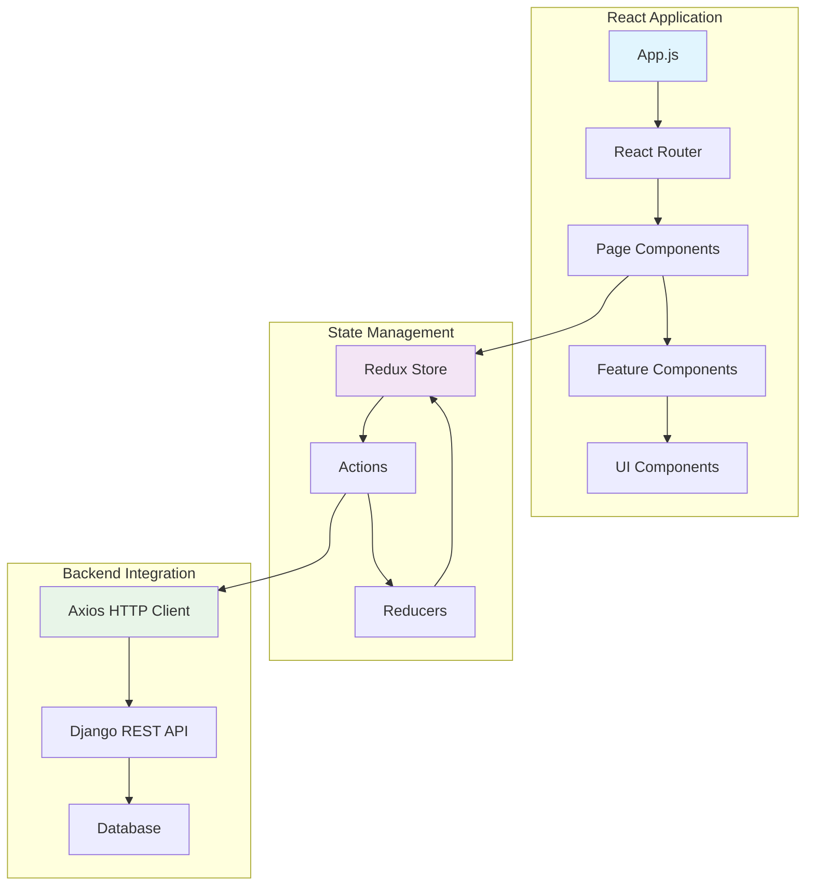

## User Authentication Flow

### Login Process

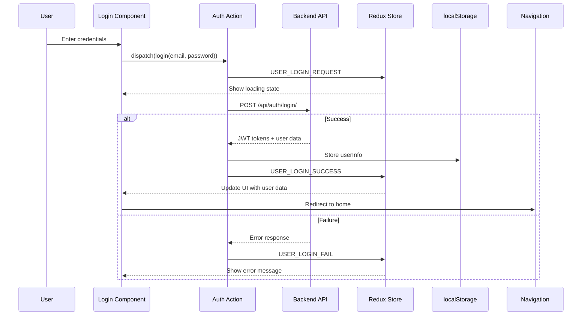

### User Registration Flow

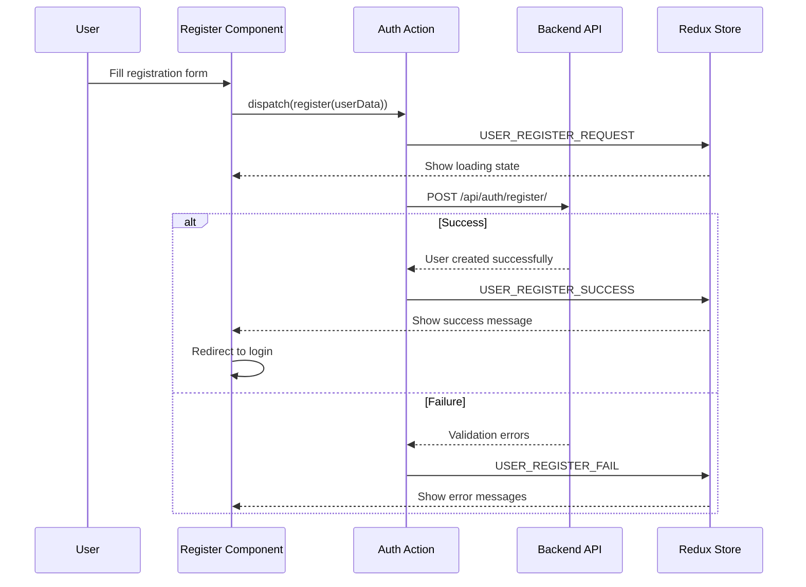

## Post Management Workflows

### Post Creation Flow

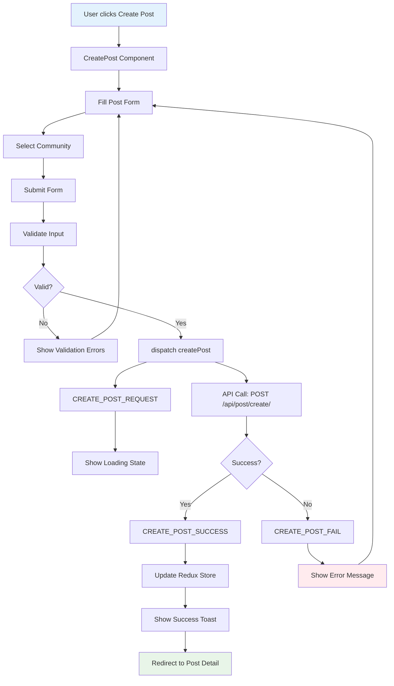

### Post Voting Flow

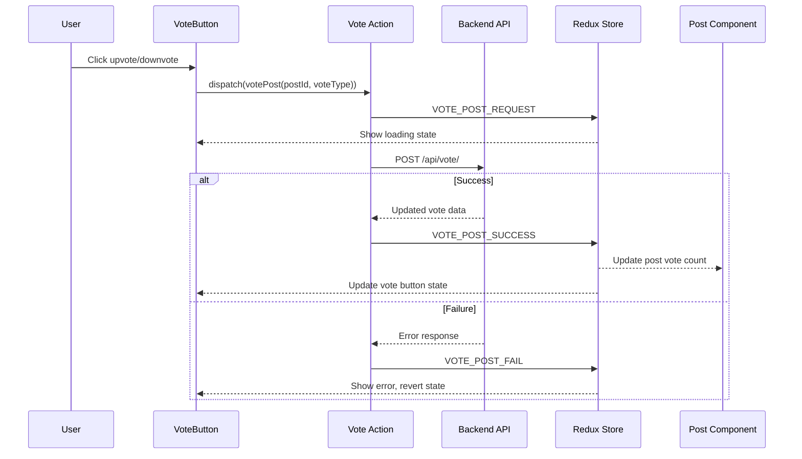

## Comment System Workflows

### Comment Creation Flow

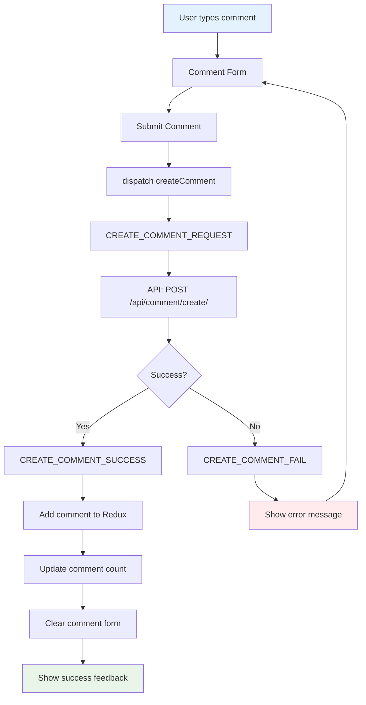

### Comment Like/Unlike Flow

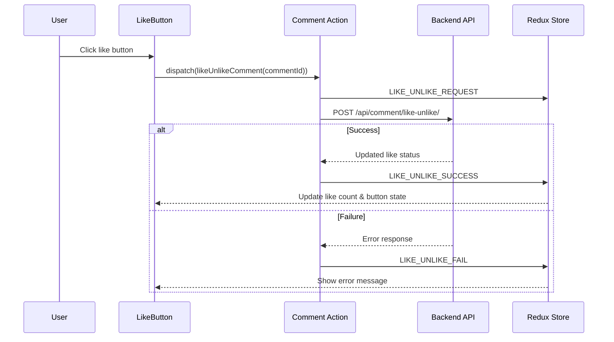

## Community (Subribbit) Workflows

### Community Creation Flow

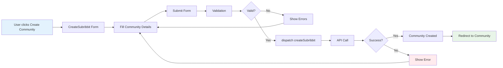

### Community Join Flow

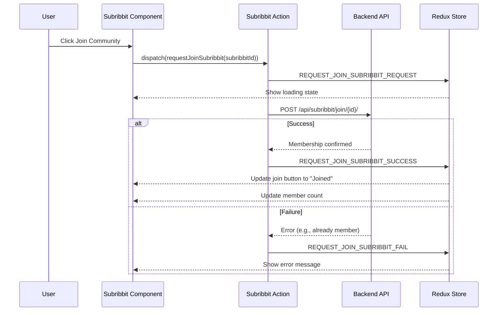

## Data Loading Patterns

### Page Load Data Flow

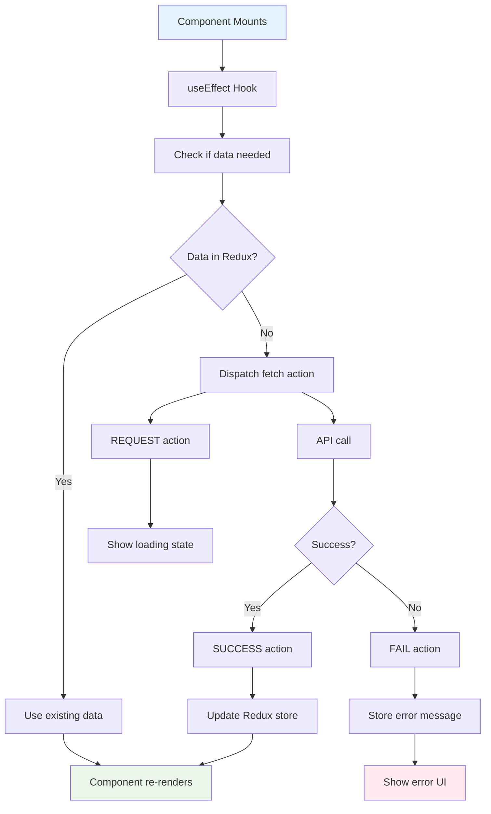

### Search Flow

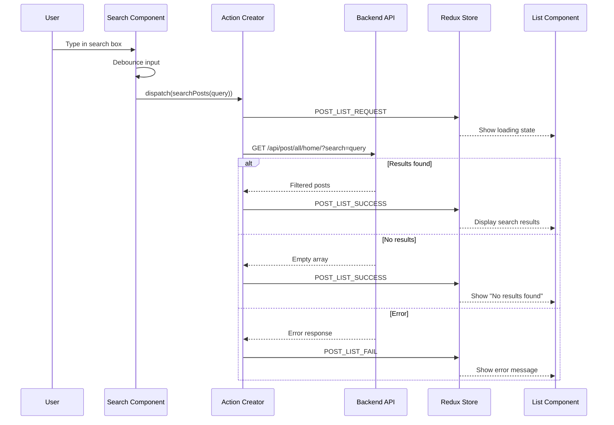

## Error Handling Workflows

### Global Error Handling

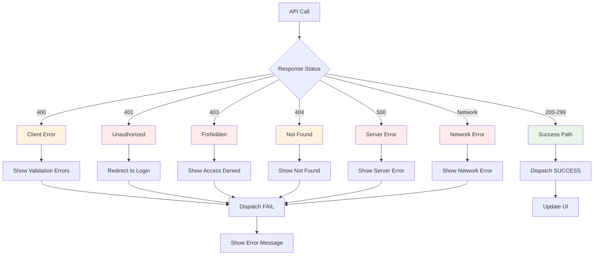

## Navigation and Routing

### Application Navigation Flow

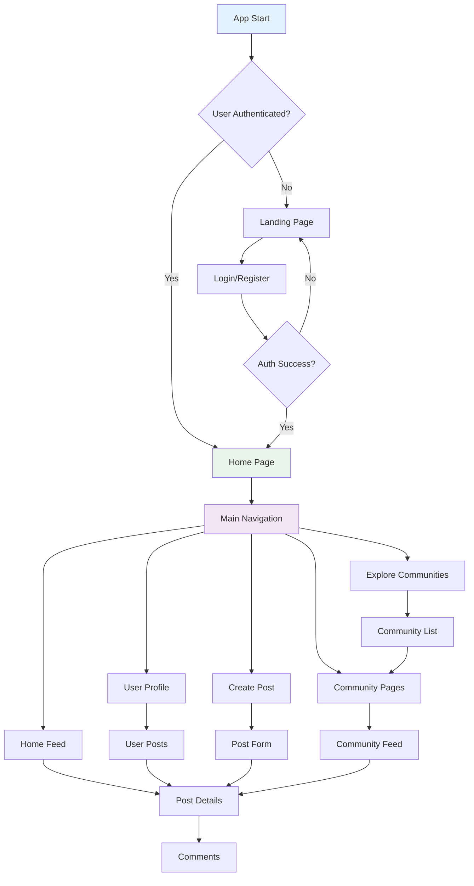

## State Management Flow

### Redux Data Flow

```mermaid
graph LR
    A[User Interaction] --> B[Component]
    B --> C[Action Creator]
    C --> D[Action Dispatch]
    D --> E[Middleware: Thunk]
    E --> F[Async Operations]
    F --> G[API Calls]
    G --> H[Response]
    H --> I[Action Dispatch]
    I --> J[Reducers]
    J --> K[Store Update]
    K --> L[Component Re-render]
    L --> M[UI Update]
    
    style A fill:#e3f2fd
    style G fill:#e8f5e8
    style K fill:#f3e5f5
    style M fill:#e8f5e8
```

### Component State vs Redux State

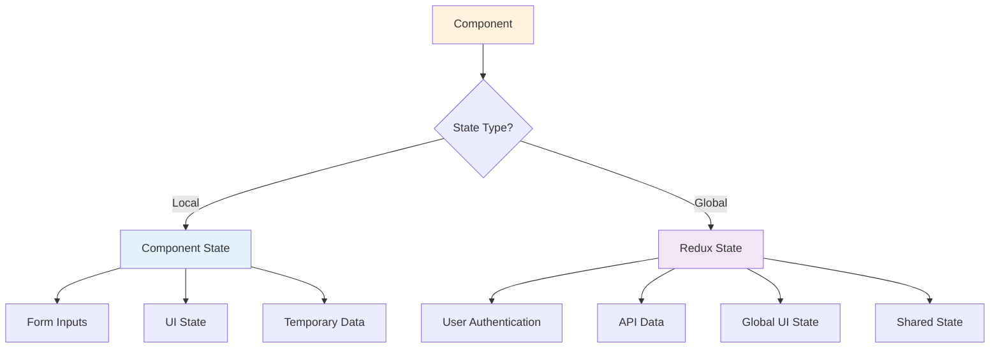

## Performance Optimization Workflows

### Lazy Loading Flow

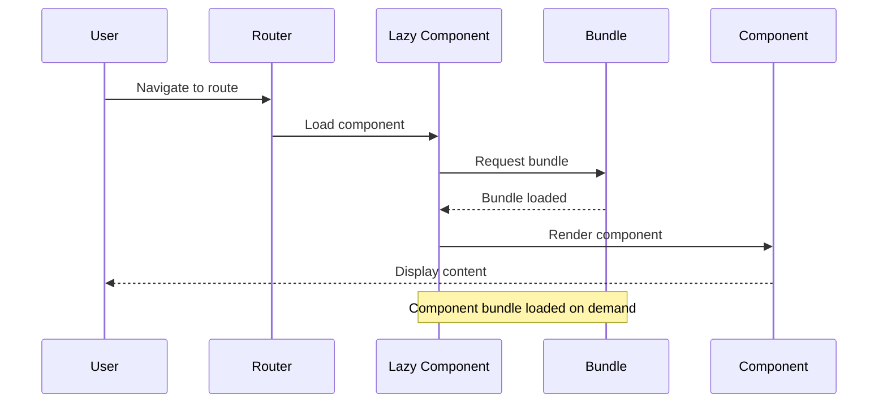

### Component Re-render Optimization

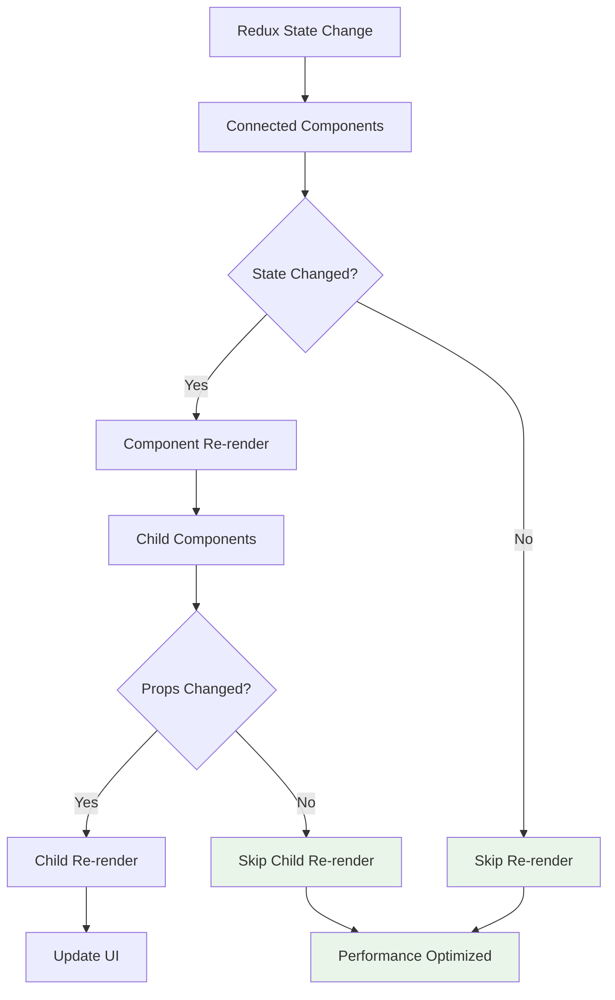

## Mobile Responsiveness Flow

### Responsive Design Workflow

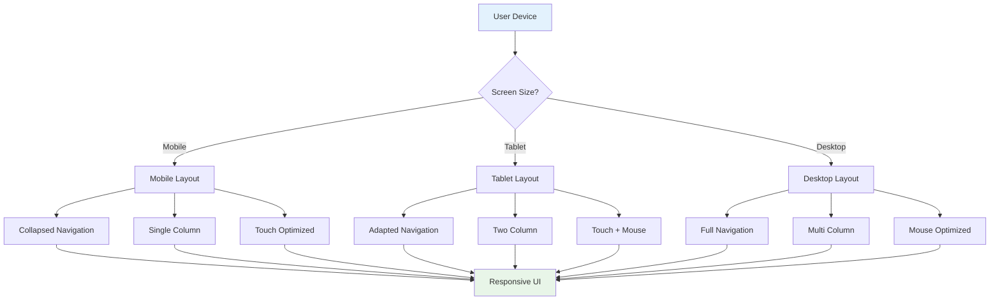

---

*These diagrams illustrate the key workflows and data flows in the Ribbit frontend application. They can be used to understand component interactions, state management patterns, and user journey flows.*