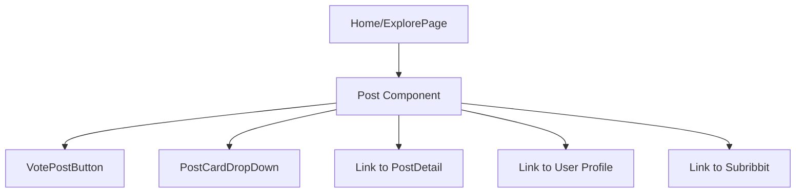
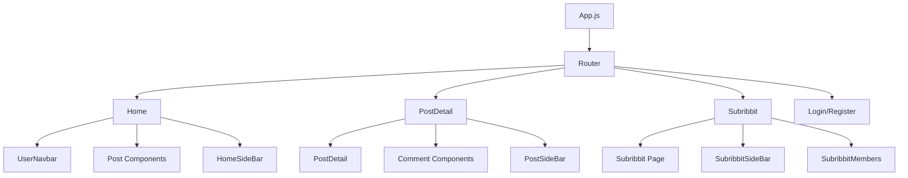
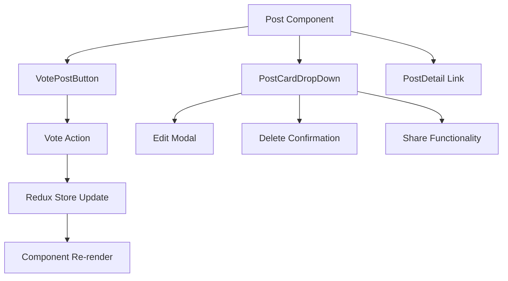

# React Components Documentation

## Overview

The Ribbit frontend uses a component-based architecture organized by feature domains. Components follow React functional component patterns with hooks for state management and lifecycle operations.

## Component Architecture

### Component Organization

Components are organized hierarchically by feature rather than by type:

```
components/
├── Auth/                 # Authentication components
├── Buttons/              # Reusable interactive buttons
├── Comments/             # Comment-related components
├── Footer/               # Application footer
├── Home/                 # Home page and explore page
├── LandingAboutPage/     # Landing page about section
├── LandingFunctionalitiesPage/ # Landing page features
├── LandingHomePage/      # Landing page main section
├── Layout/               # Layout wrapper components
├── Modals/               # Modal dialog components
├── Navbar/               # Navigation components
├── Notification/         # Notification system components
├── Posts/                # Post-related components
├── ResetPassword/        # Password reset components
├── SideBar/              # Sidebar components
├── Subribbit/            # Community (subribbit) components
├── Toasts/               # Toast notification components
├── User/                 # User profile components
└── Utilities/            # Utility and helper components
```

## Core Component Categories

### 1. Layout Components

#### Layout (`components/Layout/index.js`)
**Purpose**: Wrapper component for landing pages
**Structure**: Header + Routed Content + Footer

```javascript
const Layout = () => (
  <div>
    <Header />
    <Routes>
      <Route path="/mainLanding" element={<LandingHomePage />} />
      <Route path="/aboutLanding" element={<LandingAboutPage />} />
      <Route path="/functionalitiesLanding" element={<LandingFunctionalitiesPage />} />
    </Routes>
    <Footer />
  </div>
);
```

**Key Features**:
- Provides consistent layout structure
- Handles landing page routing
- Integrates header and footer components

#### UserNavbar (`components/Navbar/UserNavbar.js`)
**Purpose**: Main navigation component for authenticated users
**Redux Integration**: 
- `useSelector` for user authentication state
- `useSelector` for notifications

**Key Features**:
- User authentication status display
- Notification badge integration
- Navigation links to main sections
- User profile dropdown menu

### 2. Page Components

#### Home (`components/Home/Home.js`)
**Purpose**: Main feed page displaying posts from all communities
**Props**: None (uses URL parameters and query strings)
**Redux Integration**:
- `postList` - for posts data
- `deletePost` - for post deletion feedback
- `updateSubribbit` - for community updates

**Key Features**:
- Post sorting functionality (hot, new, top)
- Search functionality
- Infinite scroll or pagination
- Integration with sidebar components

**Component Structure**:
```javascript
function Home() {
    const postList = useSelector(state => state.postList);
    const { error, loading, posts } = postList;
    
    useEffect(() => {
        dispatch(listPosts('home', sort, search));
    }, [messageDeletePost, sort, updateSubribbitData, search]);
    
    return (
        <div>
            <UserNavbar />
            <Row>
                <Col md={8}>
                    {posts.map(post => <Post key={post.id} post={post} />)}
                </Col>
                <Col md={4}>
                    <HomeSideBar />
                </Col>
            </Row>
        </div>
    );
}
```

#### ExplorePage (`components/Home/ExplorePage.js`)
**Purpose**: Discovery page for exploring communities and popular content
**Similar Structure**: Like Home but with different data sources and filters

### 3. Post Components

#### Post (`components/Posts/Post.js`)
**Purpose**: Individual post card component used in feeds
**Props**: 
- `post` (object) - Post data
- `sub` (string) - Current subreddit context

**Key Features**:
- Vote button integration
- Post metadata display (author, time, community)
- NSFW content handling
- Navigation to post details

**Component Relationships**:


#### PostDetail (`components/Posts/PostDetail.js`)
**Purpose**: Full post view with comments
**Redux Integration**:
- `postDetails` - individual post data
- `allComments` - post comments
- `createComment` - comment creation state

#### CreatePost (`components/Posts/CreatePost.js`)
**Purpose**: Form for creating new posts
**Features**:
- Rich text editor integration
- Community selection
- NSFW marking
- Form validation

### 4. Comment Components

#### Comment (`components/Comments/Comment.js`)
**Purpose**: Individual comment display with threading support
**Props**:
- `comment` (object) - Comment data
- `postId` (number) - Parent post ID

**Key Features**:
- Nested comment threading
- Like/unlike functionality
- Comment moderation (delete for own comments)
- User profile linking

### 5. Authentication Components

#### Login (`components/Auth/Login.js`)
**Purpose**: User login form
**Redux Integration**:
- `userLogin` - authentication state
- `sendResetPasswordEmail` - password reset state

**Form Fields**:
- Email/username
- Password
- "Remember me" option
- Password reset link

#### Register (`components/Auth/Register.js`)
**Purpose**: User registration form
**Redux Integration**:
- `userRegister` - registration state

**Form Fields**:
- Username
- Email
- Password
- Confirm password
- Terms acceptance

### 6. Community (Subribbit) Components

#### Subribbit (`components/Subribbit/Subribbit.js`)
**Purpose**: Individual community page
**URL Pattern**: `/community/:sub`
**Features**:
- Community-specific posts
- Member management
- Community information sidebar
- Join/leave functionality

#### SubribbitList (`components/Subribbit/SubribbitList.js`)
**Purpose**: Browse all communities
**Features**:
- Community search
- Community categories
- Pagination
- Join/leave actions

#### CreateSubribbit (`components/Subribbit/CreateSubribbit.js`)
**Purpose**: Form for creating new communities
**Form Fields**:
- Community name
- Description
- Community type (public/private)
- Rules and guidelines

### 7. Modal Components

Modal components provide overlay interfaces for specific actions:

#### ConfirmDeletePostModal
- Confirms post deletion
- Prevents accidental deletions

#### UpdatePostModal
- In-line post editing
- Form pre-populated with existing content

#### UpdateMyProfileModal
- User profile editing
- Avatar upload functionality

#### SubribbitMembersModal
- Community member management
- Role assignment for moderators

### 8. Button Components

Specialized button components with built-in functionality:

#### VotePostButton (`components/Buttons/VotePostButton.js`)
**Purpose**: Upvote/downvote functionality for posts
**Props**: `post` (object)
**Redux Integration**: `votePost` state
**Features**:
- Visual vote indicators
- Vote count display
- Optimistic updates

#### LikeCommentButton (`components/Buttons/LikeCommentButton.js`)
**Purpose**: Like/unlike functionality for comments
**Similar pattern to VotePostButton**

#### PostCardDropDown (`components/Buttons/PostCardDropDown.js`)
**Purpose**: Context menu for post actions
**Actions**:
- Edit post (for author)
- Delete post (for author/moderator)
- Report post
- Share post

### 9. Sidebar Components

Sidebar components provide contextual information and actions:

#### HomeSideBar (`components/SideBar/HomeSideBar.js`)
- Recent communities
- Community suggestions
- Create community button

#### SubribbitSideBar (`components/SideBar/SubribbitSideBar.js`)
- Community information
- Member count
- Community rules
- Moderator list

#### PostSideBar (`components/SideBar/PostSideBar.js`)
- Related posts
- Community information for current post

### 10. Utility Components

#### Loader (`components/Utilities/Loader.js`)
**Purpose**: Loading indicator component
**Usage**: Displayed during async operations
**Implementation**: Bootstrap spinner component

#### Message (`components/Utilities/Message.js`)
**Purpose**: Alert message component
**Props**:
- `variant` (string) - Bootstrap alert variant (success, danger, warning, info)
- `children` - Message content

#### GeneralGetErrorPage (`components/Utilities/GeneralGetErrorPage.js`)
**Purpose**: Error page for failed data fetching
**Features**:
- User-friendly error messages
- Retry functionality
- Navigation back to safety

## Component Patterns

### 1. Redux Integration Pattern

Most components follow this pattern for Redux integration:

```javascript
import { useSelector, useDispatch } from 'react-redux';

function MyComponent() {
    const dispatch = useDispatch();
    
    // Select specific state slices
    const { data, loading, error } = useSelector(state => state.domain);
    
    // Dispatch actions
    useEffect(() => {
        dispatch(fetchData());
    }, [dispatch]);
    
    // Conditional rendering
    if (loading) return <Loader />;
    if (error) return <Message variant="danger">{error}</Message>;
    
    return <div>{/* Component content */}</div>;
}
```

### 2. Form Handling Pattern

Forms use controlled components with local state:

```javascript
function FormComponent() {
    const [formData, setFormData] = useState({
        field1: '',
        field2: ''
    });
    
    const handleSubmit = (e) => {
        e.preventDefault();
        dispatch(submitFormAction(formData));
    };
    
    const handleChange = (e) => {
        setFormData({
            ...formData,
            [e.target.name]: e.target.value
        });
    };
    
    return (
        <Form onSubmit={handleSubmit}>
            <Form.Control 
                name="field1"
                value={formData.field1}
                onChange={handleChange}
            />
        </Form>
    );
}
```

### 3. Conditional Rendering Pattern

```javascript
// Loading states
{loading && <Loader />}

// Error states
{error && <Message variant="danger">{error}</Message>}

// Success states with data
{data && data.length > 0 ? (
    data.map(item => <ItemComponent key={item.id} item={item} />)
) : (
    <div>No items found</div>
)}

// Authentication-based rendering
{userInfo ? <AuthenticatedView /> : <LoginPrompt />}
```

## Component Relationships

### Main Application Flow



### Post Interaction Flow



## Props and State Management

### Component Props Patterns

1. **Data Props**: Components receive data as props from parent components
2. **Callback Props**: Functions passed down for child-to-parent communication
3. **Configuration Props**: Boolean flags and configuration options

### Local State Usage

Components use local state for:
- Form input values
- UI-specific state (modals open/closed, dropdowns)
- Temporary state that doesn't need global access

### Global State Usage

Redux is used for:
- User authentication state
- API data (posts, comments, users, communities)
- Loading and error states for async operations
- Cross-component state sharing

## Styling and UI Framework

### Bootstrap Integration

Components use React Bootstrap components:
- `Card` - for post cards and content containers
- `Form` - for all form inputs
- `Button` - for interactive elements
- `Modal` - for overlay dialogs
- `Row/Col` - for grid layout

### Custom CSS Classes

Custom styling applied through:
- `App.css` - global styles
- `index.css` - base styles
- Component-specific IDs and classes

## Performance Considerations

### 1. Component Re-rendering

- Use `useSelector` with specific state slices to minimize re-renders
- Consider implementing `React.memo()` for expensive components
- Optimize list rendering with proper `key` props

### 2. Large Lists

- Post and comment lists may benefit from virtualization
- Consider pagination or infinite scroll for better performance

### 3. Image Loading

- Lazy loading for user avatars and post images
- Placeholder images during loading states

## Testing Considerations

### Component Testing Strategy

1. **Unit Tests**: Test individual component functionality
2. **Integration Tests**: Test component interactions with Redux
3. **User Interaction Tests**: Test user workflows end-to-end

### Testable Patterns

Components are structured to be easily testable:
- Pure functional components where possible
- Clear separation of concerns
- Predictable prop interfaces

## Common Issues and Solutions

### 1. State Synchronization

**Issue**: Components not updating when Redux state changes
**Solution**: Ensure proper `useSelector` usage and dependency arrays in `useEffect`

### 2. Memory Leaks

**Issue**: Event listeners or subscriptions not cleaned up
**Solution**: Use `useEffect` cleanup functions for subscriptions

### 3. Form State Management

**Issue**: Form state getting out of sync with global state
**Solution**: Clear local form state when global state resets

---

*This documentation covers the main component patterns and relationships. For specific component APIs and props, refer to individual component files and their JSDoc comments.*