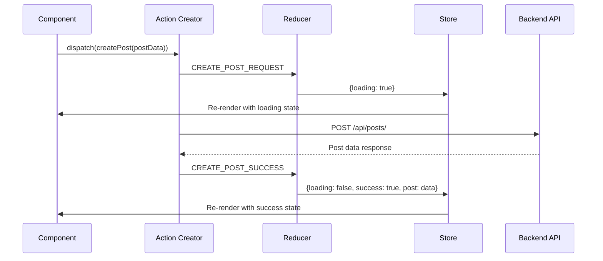
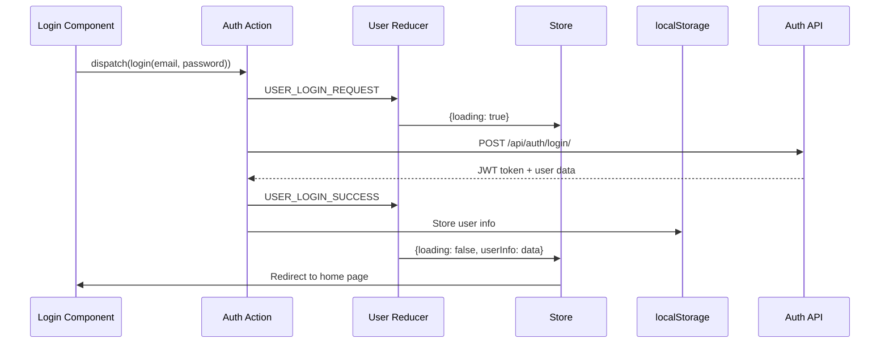

# Redux State Management Documentation

## Overview

The Ribbit frontend uses Redux for centralized state management with Redux Thunk middleware for handling asynchronous operations. The store follows a normalized approach with separate reducers for each domain.

## Store Configuration

### Store Setup (`store.js`)

```javascript
import { createStore, combineReducers, applyMiddleware } from "redux";
import thunk from "redux-thunk";
import { composeWithDevTools } from 'redux-devtools-extension';
```

**Key Features:**
- Redux DevTools integration for development
- Thunk middleware for async action creators
- localStorage persistence for user authentication state

### Initial State

```javascript
const initialState = {
    userLogin: { userInfo: userInfoFromStorage }
};
```

User authentication state is hydrated from localStorage on application initialization.

## State Structure

The Redux store is organized into the following domains:

```javascript
const reducer = combineReducers({
    // Post Management
    postList: postListReducers,
    postDetails: postDetailsReducers,
    createPost: createPostReducers,
    userPosts: userPostListReducers,
    deletePost: deletePostReducers,
    updatePost: updatePostReducers,
    
    // User Management
    userLogin: userLoginReducers,
    userRegister: userRegisterReducer,
    userDetails: userDetailsReducers,
    updateUserProfile: updateUserProfileReducers,
    sendResetPasswordEmail: sendResetPasswordEmailReducers,
    resetPassword: resetPasswordReducers,
    
    // Comment Management
    createComment: createCommentReducers,
    allComments: getAllCommentReducers,
    likeUnlike: likeUnlikeReducers,
    deleteComment: deleteCommentReducers,
    
    // Voting System
    votePost: votePostReducers,
    
    // Subribbit (Community) Management
    createSubribbit: createSubribbitReducers,
    subribbitList: subribbitListReducers,
    ownedAndJoinedSubribbitList: ownedAndJoinedSubribbitListReducers,
    subribbitDetails: subribbitDetailsReducers,
    requestJoinSubribbit: requestJoinSubribbitReducers,
    subribbitMembers: subribbitMembersReducers,
    subribbitMembersForMembers: subribbitMembersForMembersReducers,
    updateSubribbitMember: updateSubribbitMemberReducers,
    updateSubribbit: updateSubribbitReducers,
    topSubribbitList: topSubribbitListReducers,
    
    // Notification System
    allNotifications: getAllNotificationsReducers,
});
```

## Action Type Patterns

### Naming Convention

All action types follow a consistent pattern:

```javascript
// Async Operations
export const OPERATION_REQUEST = 'OPERATION_REQUEST'
export const OPERATION_SUCCESS = 'OPERATION_SUCCESS'
export const OPERATION_FAIL = 'OPERATION_FAIL'

// Additional States
export const OPERATION_RESET = 'OPERATION_RESET'
export const OPERATION_DONE = 'OPERATION_DONE'
```

### Action Type Categories

1. **Authentication Actions**
   - `USER_LOGIN_*` - User login flow
   - `USER_REGISTER_*` - User registration
   - `USER_LOGOUT` - User logout (synchronous)
   - `RESET_PASSWORD_*` - Password reset flow

2. **Post Actions**
   - `POST_LIST_*` - Fetch all posts
   - `POST_DETAILS_*` - Fetch single post
   - `CREATE_POST_*` - Create new post
   - `UPDATE_POST_*` - Update existing post
   - `DELETE_POST_*` - Delete post

3. **Comment Actions**
   - `CREATE_COMMENT_*` - Add comment to post
   - `GET_ALL_COMMENT_*` - Fetch post comments
   - `LIKE_UNLIKE_*` - Comment like/unlike
   - `DELETE_COMMENT_*` - Remove comment

4. **Subribbit Actions**
   - `CREATE_SUBRIBBIT_*` - Create community
   - `SUBRIBBIT_LIST_*` - Fetch communities
   - `REQUEST_JOIN_SUBRIBBIT_*` - Join community
   - `UPDATE_SUBRIBBIT_MEMBER_*` - Manage members

## Reducer Patterns

### Standard Async Reducer Pattern

All async operations follow this pattern:

```javascript
export const exampleReducer = (state = { items: [] }, action) => {
    switch (action.type) {
        case OPERATION_REQUEST:
            return {
                loading: true,
                items: [] // or preserve existing state
            }

        case OPERATION_SUCCESS:
            return {
                loading: false,
                items: action.payload
            }

        case OPERATION_FAIL:
            return {
                loading: false,
                error: action.payload
            }

        default:
            return state;
    }
}
```

### State Properties

Each reducer typically manages these properties:

- `loading` - Boolean indicating async operation in progress
- `error` - Error message from failed operations
- `success` - Boolean indicating successful operation
- `data/items` - The actual data payload

### Reset Actions

Many reducers include reset functionality:

```javascript
case OPERATION_RESET:
    return {} // or initial state
```

Used to clear form states, error messages, or success indicators.

## Action Creator Patterns

### Async Action Creators

Using Redux Thunk for async operations:

```javascript
export const exampleAction = (params) => async (dispatch) => {
    try {
        dispatch({ type: OPERATION_REQUEST })

        const config = {
            headers: {
                'Content-type': 'application/json'
            }
        }

        const { data } = await axios.post(
            backendUrl + 'api/endpoint/',
            params,
            config
        )

        dispatch({
            type: OPERATION_SUCCESS,
            payload: data
        })

    } catch (error) {
        dispatch({
            type: OPERATION_FAIL,
            payload: error.response?.data?.detail || 'Operation failed'
        })
    }
}
```

### Authentication Action Patterns

Authentication actions include localStorage management:

```javascript
// Login success
dispatch({
    type: USER_LOGIN_SUCCESS,
    payload: data
})
localStorage.setItem('userInfo', JSON.stringify(data))

// Logout
localStorage.removeItem('userInfo')
dispatch({ type: USER_LOGOUT })
```

## State Access Patterns

### Modern Hook-Based Access

Components use React-Redux hooks:

```javascript
import { useSelector, useDispatch } from 'react-redux';

const MyComponent = () => {
    const dispatch = useDispatch();
    
    // Select specific state slices
    const { posts, loading, error } = useSelector(state => state.postList);
    const userInfo = useSelector(state => state.userLogin.userInfo);
    
    // Dispatch actions
    const handleAction = () => {
        dispatch(someAction());
    };
    
    return (
        <div>
            {loading && <Loader />}
            {error && <Message variant="danger">{error}</Message>}
            {posts.map(post => <PostCard key={post.id} post={post} />)}
        </div>
    );
};
```

### Conditional Rendering Based on State

```javascript
// Loading states
{loading && <Loader />}

// Error states
{error && <Message variant="danger">{error}</Message>}

// Success states
{success && <Message variant="success">Operation completed!</Message>}

// Data rendering
{posts && posts.length > 0 ? (
    posts.map(post => <PostCard key={post.id} post={post} />)
) : (
    <div>No posts available</div>
)}
```

## State Management Best Practices

### 1. Normalized State Structure

- Each entity type has its own reducer
- Avoid deep nesting in state structure
- Keep related data together but separate concerns

### 2. Loading State Management

```javascript
// Component rendering logic
if (loading) return <Loader />;
if (error) return <Message variant="danger">{error}</Message>;
if (!data) return <div>No data available</div>;
return <DataComponent data={data} />;
```

### 3. Error Handling

- Consistent error message format across reducers
- User-friendly error messages displayed in UI
- Error states cleared on successful operations

### 4. Form State Management

- Use reset actions to clear form states
- Manage form submission states separately
- Provide user feedback for form operations

## State Flow Examples

### Post Creation Flow



### User Authentication Flow



## Performance Considerations

### 1. Selective State Updates

- Use specific selectors to prevent unnecessary re-renders
- Avoid selecting entire state tree in components

### 2. Memoization Opportunities

```javascript
// Consider memoizing expensive selectors
const expensiveSelector = useMemo(() => 
    state.posts.filter(post => /* complex logic */)
, [state.posts]);
```

### 3. State Normalization

- Keep state structure flat when possible
- Use entity IDs as keys for efficient lookups
- Separate loading states from data

## Common Patterns and Anti-Patterns

### ✅ Good Practices

1. **Consistent action naming**: Follow `DOMAIN_OPERATION_STATUS` pattern
2. **Predictable state shape**: Each reducer has similar structure
3. **Error handling**: Consistent error message handling
4. **Loading states**: Clear loading indicators for async operations

### ❌ Anti-Patterns to Avoid

1. **Direct state mutation**: Always return new state objects
2. **Storing derived data**: Calculate derived data in components/selectors
3. **Over-normalizing**: Don't normalize every piece of data
4. **Ignoring loading states**: Always provide loading feedback

## Debugging and Development Tools

### Redux DevTools

- Time-travel debugging available in development
- Action inspection and state diff viewing
- Performance monitoring for action dispatching

### Logging

```javascript
// Debug action flow
console.log('Action dispatched:', action.type, action.payload);
console.log('State after action:', getState());
```

## Migration Considerations

### Future Improvements

1. **Redux Toolkit**: Consider migration to Redux Toolkit for simpler syntax
2. **TypeScript**: Add type safety to actions and state
3. **Selectors**: Implement reselect for optimized state selection
4. **Middleware**: Add custom middleware for logging or analytics

---

*This documentation covers the current Redux implementation. For component-specific state usage, refer to individual component documentation.*