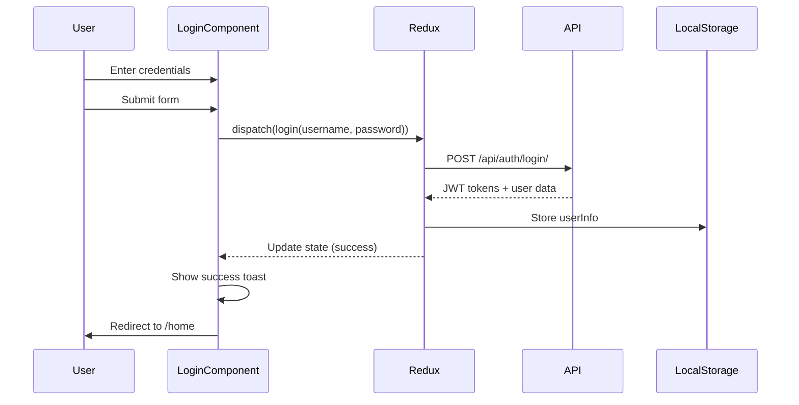
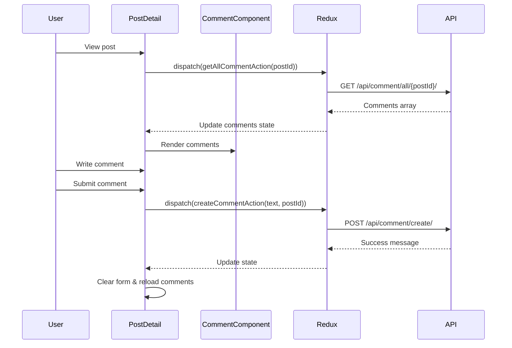
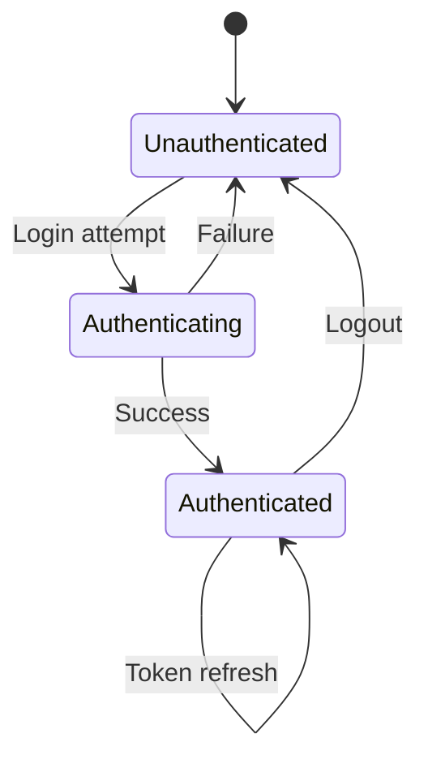
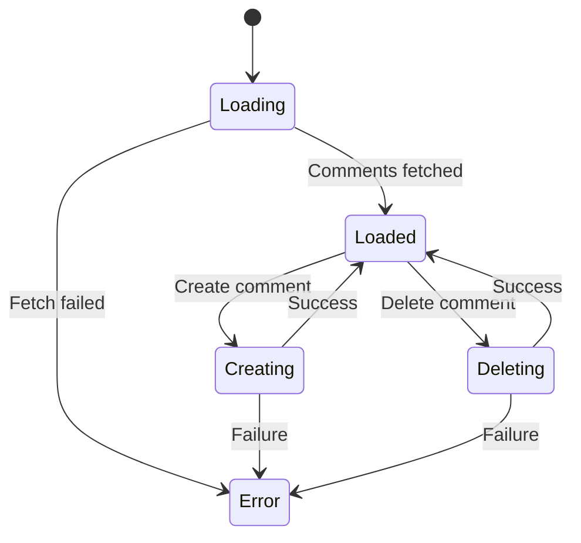

# Frontend Login and Comments Flows Documentation

## Overview

This document provides comprehensive documentation for the frontend authentication (login) and comments system flows in the Ribbit application. Ribbit is a Reddit clone built with React 17 and Redux for state management, featuring a Django REST API backend.

## Table of Contents

1. [Architecture Overview](#architecture-overview)
2. [Login Flow](#login-flow)
3. [Comments Flow](#comments-flow)
4. [Key Components](#key-components)
5. [State Management](#state-management)
6. [Error Handling](#error-handling)
7. [Authentication Patterns](#authentication-patterns)

## Architecture Overview

The frontend uses a standard React + Redux architecture with the following key patterns:

- **Component-based architecture**: Organized by feature under `frontend/src/components/`
- **Redux for state management**: Centralized state with actions, reducers, and store
- **Thunk middleware**: For handling asynchronous operations
- **Bootstrap 5**: For UI styling
- **JWT Authentication**: Token-based authentication with refresh tokens

### Key Directories

```
frontend/src/
├── components/
│   ├── Auth/              # Login, Register components
│   ├── Comments/          # Comment display and interaction
│   ├── Buttons/           # Interactive buttons (Like, Delete, etc.)
│   └── Posts/             # Post-related components
├── actions/               # Redux action creators
├── reducers/              # Redux reducers
├── securityUtils/         # Authentication utilities
└── store.js               # Redux store configuration
```

## Login Flow

### Overview

The login system handles user authentication using JWT tokens with the following features:

- Username/password authentication
- Token storage in localStorage
- Automatic redirects based on authentication status
- Error handling with toast notifications
- Password reset functionality

### Login Flow Diagram



### Key Components

#### Login Component (`frontend/src/components/Auth/Login.js`)

**Purpose**: Handles user login interface and authentication flow

**Key Features**:
- Form validation with required fields
- Loading states during authentication
- Error handling with toast notifications
- Automatic redirect to home page on success
- Conditional rendering based on authentication status

**State Management**:
- Uses `useSelector` to access `userLogin` state
- Dispatches `login` action on form submission
- Handles loading, error, and success states

**Flow**:
1. User enters username and password
2. Form submission triggers `submitHandler`
3. Dispatches `login(username, password)` action
4. Loading state shows during API call
5. On success: stores token and redirects to home
6. On error: shows error toast and clears state

#### Register Component (`frontend/src/components/Auth/Register.js`)

**Purpose**: Handles new user registration

**Key Features**:
- Username, email, password, and confirm password fields
- Validation for password matching
- Success flow redirects to login page
- Error handling with toast notifications

### Authentication Actions (`frontend/src/actions/userActions.js`)

#### login(email, password)

**Purpose**: Authenticates user and stores JWT tokens

**Flow**:
1. Dispatches `USER_LOGIN_REQUEST`
2. Makes POST request to `/api/auth/login/`
3. On success:
   - Dispatches `USER_LOGIN_SUCCESS` with user data
   - Stores `userInfo` in localStorage
4. On error:
   - Dispatches `USER_LOGIN_FAIL` with error message

#### logout()

**Purpose**: Clears user session

**Flow**:
1. Removes `userInfo` from localStorage
2. Dispatches `USER_LOGOUT` to clear Redux state

#### register(username, email, password, confirmPassword)

**Purpose**: Creates new user account

**Flow**:
1. Dispatches `USER_REGISTER_REQUEST`
2. Makes POST request to `/api/auth/register/`
3. On success: Dispatches `USER_REGISTER_SUCCESS` with success message
4. On error: Dispatches `USER_REGISTER_FAIL` with error message

### Authentication State Management

#### User Login Reducer (`frontend/src/reducers/userReducer.js`)

**State Structure**:
```javascript
{
  loading: boolean,
  userInfo: {
    username: string,
    email: string,
    access: string,  // JWT access token
    refresh: string  // JWT refresh token
  },
  error: string
}
```

**Actions Handled**:
- `USER_LOGIN_REQUEST`: Sets loading to true
- `USER_LOGIN_SUCCESS`: Stores user info, sets loading to false
- `USER_LOGIN_FAIL`: Stores error message, sets loading to false
- `USER_LOGOUT`: Clears all user data

### Store Configuration (`frontend/src/store.js`)

**Initial State**:
- Reads `userInfo` from localStorage on app startup
- Preserves authentication state across browser sessions

**Middleware**:
- Redux Thunk for async operations
- Redux DevTools for development

## Comments Flow

### Overview

The comments system provides full CRUD functionality for post comments with the following features:

- Create new comments on posts
- Display comments with user information
- Like/unlike comments
- Delete own comments
- Real-time updates after operations

### Comments Flow Diagram



### Key Components

#### Comment Component (`frontend/src/components/Comments/Comment.js`)

**Purpose**: Renders individual comment with user info and actions

**Key Features**:
- Displays user avatar and username
- Shows comment text with @mention support
- Timestamp with human-readable format
- Like button with count
- Delete button (only for comment owner)

**Props**:
- `comment`: Comment data object
- `post`: Post data object
- `user`: Current user information

#### PostDetail Component (`frontend/src/components/Posts/PostDetail.js`)

**Purpose**: Main component for displaying post and managing comments

**Key Features**:
- Post content display
- Comment creation form (authenticated users only)
- Comments list rendering
- Real-time updates after comment operations
- Loading states and error handling

**Comment Management**:
- Fetches comments on component mount
- Handles comment creation
- Manages form state and validation
- Displays authentication prompts for anonymous users

### Comment Actions (`frontend/src/actions/commentActions.js`)

#### createCommentAction(text, postId)

**Purpose**: Creates new comment on a post

**Authentication**: Requires JWT token

**Flow**:
1. Dispatches `CREATE_COMMENT_REQUEST`
2. Makes POST request to `/api/comment/create/`
3. Includes comment text and post ID
4. On success: Dispatches `CREATE_COMMENT_SUCCESS`
5. On error: Dispatches `CREATE_COMMENT_FAIL`

#### getAllCommentAction(postId)

**Purpose**: Fetches all comments for a specific post

**Authentication**: Optional (affects like status)

**Flow**:
1. Dispatches `GET_ALL_COMMENT_REQUEST`
2. Makes GET request to `/api/comment/all/{postId}/`
3. Includes auth token if user is logged in
4. On success: Dispatches `GET_ALL_COMMENT_SUCCESS` with comments array
5. On error: Dispatches `GET_ALL_COMMENT_FAIL`

#### likeUnlikeAction(commentId)

**Purpose**: Toggles like status for a comment

**Authentication**: Requires JWT token

**Flow**:
1. Dispatches `LIKE_UNLIKE_REQUEST`
2. Makes POST request to `/api/comment/likeUnlike/`
3. Backend toggles like status
4. On success: Dispatches `LIKE_UNLIKE_SUCCESS`
5. On error: Dispatches `LIKE_UNLIKE_FAIL`

#### deleteCommentAction(commentId)

**Purpose**: Deletes a comment (owner only)

**Authentication**: Requires JWT token

**Flow**:
1. Dispatches `DELETE_COMMENT_REQUEST`
2. Makes DELETE request to `/api/comment/delete/{commentId}/`
3. Backend validates ownership
4. On success: Dispatches `DELETE_COMMENT_SUCCESS`
5. On error: Dispatches `DELETE_COMMENT_FAIL`

### Comment State Management

#### Comment Reducers (`frontend/src/reducers/commentReducer.js`)

**Create Comment Reducer**:
```javascript
{
  loadingCreateComment: boolean,
  messageCreateComment: string,
  errorCreateComment: string
}
```

**Get All Comments Reducer**:
```javascript
{
  loadingAllComments: boolean,
  comments: Array<Comment>,
  errorAllComments: string
}
```

**Like/Unlike Reducer**:
```javascript
{
  loading: boolean,
  message: string,
  error: string
}
```

**Delete Comment Reducer**:
```javascript
{
  loading: boolean,
  message: string,
  error: string
}
```

### Interactive Components

#### LikeCommentButton (`frontend/src/components/Buttons/LikeCommentButton.js`)

**Purpose**: Handles comment liking functionality

**Key Features**:
- Visual feedback for liked state
- Optimistic UI updates
- Authentication check
- Real-time like count updates

**State Management**:
- Local state for immediate UI feedback
- Redux action for API synchronization

#### DeleteCommentButton (`frontend/src/components/Buttons/DeleteCommentButton.js`)

**Purpose**: Handles comment deletion

**Key Features**:
- Ownership validation
- Confirmation modal
- Loading states
- Success feedback

## Key Components

### Security Utils

#### setToken (`frontend/src/securityUtils/setToken.js`)

**Purpose**: Manages axios default authorization headers

**Usage**:
- Sets Bearer token for authenticated requests
- Removes token on logout

### Store Configuration

#### Redux Store (`frontend/src/store.js`)

**Features**:
- Combined reducers for all app state
- Persistent authentication state
- Redux DevTools integration
- Thunk middleware for async operations

**Initial State**:
- Restores user authentication from localStorage
- Provides base state for all reducers

## State Management

### Authentication State Flow



### Comment State Flow



## Error Handling

### Authentication Errors

- **Invalid credentials**: Shows error toast, clears form
- **Network errors**: Shows generic error message
- **Token expiration**: Automatically logs out user

### Comment Errors

- **Creation errors**: Shows error toast, keeps form data
- **Loading errors**: Shows error message, provides retry option
- **Permission errors**: Shows appropriate error message

### Error Patterns

1. **Toast Notifications**: Used for user feedback
2. **Loading States**: Prevents duplicate requests
3. **Error Boundaries**: Graceful error handling
4. **Retry Logic**: Available for failed operations

## Authentication Patterns

### Protected Routes

- Components check `userInfo` from Redux state
- Redirect to login if authentication required
- Conditional rendering based on auth status

### Token Management

- JWT tokens stored in localStorage
- Automatic inclusion in API requests
- Token refresh handled by backend

### Permission Checks

- User ownership validation for delete operations
- Different UI states for authenticated/anonymous users
- Role-based access control where applicable

## Usage Examples

### Creating a Comment

```javascript
// In PostDetail component
const submitHandler = (e) => {
    e.preventDefault()
    dispatch(createCommentAction(text, postId))
}
```

### Checking Authentication

```javascript
// In any component
const userLogin = useSelector(state => state.userLogin)
const { userInfo } = userLogin

if (userInfo) {
    // User is authenticated
} else {
    // User is not authenticated
}
```

### Handling Like Action

```javascript
// In LikeCommentButton
const submitHandler = (e) => {
    e.preventDefault()
    dispatch(likeUnlikeAction(comment.id))
    likeSwitch() // Optimistic update
}
```

## Best Practices

1. **State Management**: Use Redux for global state, local state for UI-only changes
2. **Error Handling**: Always provide user feedback for errors
3. **Loading States**: Show loading indicators for async operations
4. **Authentication**: Check auth status before rendering protected content
5. **Optimistic Updates**: Update UI immediately, sync with server asynchronously
6. **Form Validation**: Validate inputs before submission
7. **Token Security**: Store tokens securely, handle expiration gracefully

## Troubleshooting

### Common Issues

1. **"Not authenticated" errors**: Check if JWT token is present and valid
2. **Comments not loading**: Verify API endpoint and post ID
3. **Like button not working**: Ensure user is authenticated
4. **Form not submitting**: Check form validation and required fields

### Debug Steps

1. Check Redux DevTools for state changes
2. Verify API requests in Network tab
3. Check console for JavaScript errors
4. Validate JWT token expiration
5. Confirm user permissions for operations

---

This documentation covers the complete frontend flows for authentication and comments in the Ribbit application. For backend API documentation, refer to the Django REST Framework documentation and API endpoints.